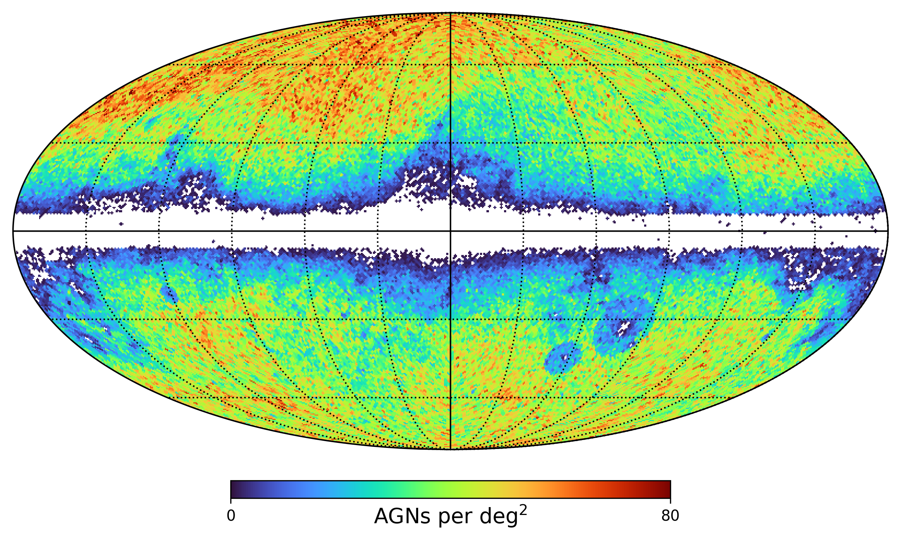
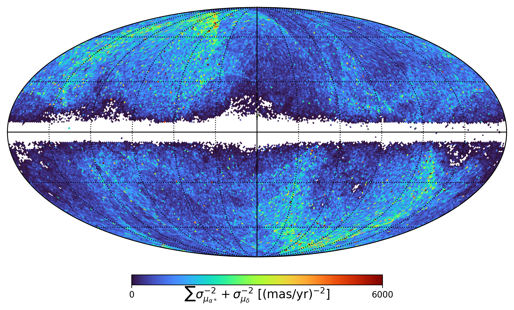

#  Project Overview :mag: :memo:

We present an independent reproduction of the solar system acceleration measurement reported in Gaia EDR3, using extragalactic sources as a non-rotating reference frame. Adopting a Bayesian inference approach based on vector spherical harmonics, we obtain results consistent with  [Klioner et al. (2021)](https://www.aanda.org/articles/aa/full_html/2021/05/aa39734-20/aa39734-20.html) in both magnitude and direction. Additionally, we explore the robustness of the inferred acceleration under varying outlier rejection thresholds and analyse the power spectral distribution of the VSH coefficients. Our findings reinforce the reliability of Gaia-based acceleration detection and validate alternative statistical methodologies.

---
# About Gaia Mission :satellite: :milky_way:

In 2013, the European Space Agency’s (ESA) (see [Prusti et al. (2016)](https://www.aanda.org/articles/aa/abs/2016/11/aa29272-16/aa29272-16.html)), launched a space telescope under
the Gaia mission (ended 27th of March 2025), with the main objective of scanning the sky to reproduce
the most precise 3D map of the Milky Way. This was achieved by measuring the positions, distances,
motions, and other properties of over a billion stars, transforming our understanding of Galactic structure,
stellar kinematics and fundamental reference frames, highly important for the scope of this project.
Gaia EDR3 is a major data release from the ESA’s Gaia mission, published in December 2020. It
includes improved astrometric and photometric data from nearly 1.8 billion sources, offering the most
precise measurements of the positions, parallaxes, and proper motions. This served as a key step from
DR2 to DR3, with significant advance in data quality and coverage.

---

## QSO-like or quasars
A <b>Quasi-Stellar Object</b> (QSO), commonly known as a quasar, is an extremely luminous <b>Active Galactic Nucleus</b> (AGN). Most massive galaxies are believed to host a supermassive black hole at their center, with masses ranging from millions to tens of billions of solar masses. An <b>accretion disk</b> forms from gas and dust spiraling toward the black hole, heated by intense viscous and magnetic processes, emitting enormous amounts of radiation across the electromagnetic spectrum, particularly in optical, ultraviolet, and X-ray wavelengths. Below we have a sky distributions of Gaia-CRF3 QSO-like sources using a Mollweide
projection with a linear colour scale ranging from 0 to 80 ANGs per deg square (upper Figure), and the statistical weights usend in proper motion analysis (lower).



---
## Getting started :rocket:
---
### Python Virtual Enviroments :snake: :test_tube:

1. Create a Virtual Environment

   Run the following command to create your virtual environment

   ``` bash
    python -m venv <your_env>

- If the above command fails, please try:
   ```bash
   python3 -m venv <your_env>

Replace `<your_env>` with your preferred environment name, e.g. `gaia_venv`.

2. Activate your virtual environment

  Activate your virtual environment with:
   ```bash
    source <your_env>/bin/activate
   ```
  Deactivate your environment with:
   ```bash
    deactivate
   ```
3. To install all the required libraries please run the command:
   ```bash
   pip install -r requirements.txt
   ```
---

### Bonus Tip :gift:

Most functions in this repository are coded with [JAX](https://docs.jax.dev/en/latest/index.html), a library for numerical computation resembling most properties of [NumPy](https://numpy.org/), with automatic differentiation (hence natural choice for coding VSH functions) including [JIT](https://docs.jax.dev/en/latest/_autosummary/jax.jit.html) compilation to speed up computations. 
Like any other Python library, JAX can be installed for CPU on Linux, Windows and macOS. Additionally, if you machine has access to a NVIDIA GPU, it is recommended that you install JAX for GPU with:
  ```bash
  pip install -U "jax[cuda12]"
  ```
If you have a GPU, I strongly recommend installing JAX using the command above, as it will significantly speed up computations! To verify that your GPU is active with JAX run the following command:
  ```python
  import jax
  print(jax.devices())
  ```
If the output shows:
  ```bash
  [CudaDevice(id=0)]
  ```
Then your GPU is active and ready to compute with JAX. For more infromation please see [source](https://docs.jax.dev/en/latest/quickstart.html).

---

### Conda Environments :snake: :test_tube:

1. Create a Conda Environment
   Run the following command to create your Conda environment

    ```bash
    conda env create -f environment.yml
    ```

All the required libraries will be automatically installed.

2. Activate your Conda envorpnment

    ```bash
    conda activate gaia_venv
    ```

   To deactivate: 
   
    ```bash
    conda deactivate
    ```
---

## Download Data :ringed_planet: :telescope: :floppy_disk:

1. <b>Access the Gaia Archive:</b> :card_index_dividers:
     - Go to the Gaia Archive: [https://gea.esac.esa.int/archive/](https://gea.esac.esa.int/archive/)
     - This is the official ESA Gaia Archive, where you can query and download the data.

2. <b>Query for QSO-like Objects:</b> :sparkles: 
     - The QSO-like objects in Gaia EDR3 are provided in the agn_cross_id table.
     - To download the full dataset run the following command on your terminal:
          ```bash
          wget -r -np -nH --cut-dirs=3 -A "*.csv.gz" https://cdn.gea.esac.esa.int/Gaia/gedr3/auxiliary/agn_cross_id/
          ```
        This allows you to download all the ```.cvs.gz``` files.

3. <b>Checking Data</b> :hammer_and_wrench:
     - Extract the files:
       If the files are compressed in a (```.gz```) format, you can extract them with:
       ```bash
       gunzip agn_cross_id/*.csv.gz
       ```
       (<b>Note:</b> make sure you are in the right directory!)

     - Load the data in Python:

4. <b>Downloading full dataset using Python</b> :arrow_down: :inbox_tray:

The above procedure does not allow the download of the full dataset. Instead run the following python code on you notebook. Note you need the Python package [```astroquery```](https://astroquery.readthedocs.io/en/latest/).

Install ```astroquery``` with ```pip install astroquery```, one installed run the following code on your notebook. 
```python

from astroquery.gaia import Gaia
import pandas as pd

# Query to get the astrometric properties of QSO-like objects
query = """
SELECT 
    agn.source_id, 
    gs.ra, gs.dec, 
    gs.pmra, gs.pmdec, 
    gs.parallax, gs.parallax_error, 
    gs.ruwe, gs.phot_g_mean_mag,
    gs.nu_eff_used_in_astrometry,
    gs.pmra_error,
    gs.pmdec_error,
    gs.pmra_pmdec_corr,
    gs.astrometric_params_solved
FROM gaiadr3.agn_cross_id AS agn
JOIN gaiadr3.gaia_source AS gs 
ON agn.source_id = gs.source_id

"""

# Launch query and download data
job = Gaia.launch_job_async(query)
result = job.get_results()

# Save as CSV
result.write("qso_full_data.csv", format="csv", overwrite=True)

# Load into Pandas
df = pd.read_csv("qso_full_data.csv")
print(df.head())  # Check the data

```
This will allow you to store the data in your directory, in the file ```qso_full_data.csv```. 

---
## Key Features :key:

:memo: List of all the things the pipeline and codebase do:

-	Computes vectors spherical harmonics (VSH) expansion, the pipeline is built on JAX, allowing automatic differentiation, a crucial feature for VSH frameworks. 
-	Perform weighted least square fit. See Equation 23, Section 4, in [report](report/report.pdf).
-	Perform Hamiltonian Monte Carlo sampling Algorithm. Check for convergence, reduce autocorrelation in samples, by estimating the integrated autocorrelation time and thin samples accordingly. 

---------------------------------------------------

## :open_file_folder: Directory Structure 
<pre>
📂 Gaia_EDR3/
│
├── 📘 Instructions.md                                        # Instructions for student
├── ⚖️ LICENSE
├── 📘 Project_Notes.md                                       # Additional notes on the project
├── 📘 README.md
│
├── 📂 csv_files/                                             # Store data
│
├── ⚙️ environment.yml                                        # Conda SetUp
├── 📓 functions_test.ipynb                                   # Where we test VSH model
├── 📂 hmc_samples/                                           # Store posterior samples stored as pkl files      
│   ├── 📁 diagnostic_hmc                                     # Store diagnostic of samples
│   ├── 📁 extension                                          # Diagnostic + posterior for extension
│   ├── 📁 main_results                                       # Diagnostic + posterior samples for main results (i.e. lmax=3)
│   └── 📁 posterior_samples                                  # Store posterior samples
│   
├── 📓 main.ipynb                                             # Download data, process data, main analysis
├── 📂 outlier_mask/                                          # Store masks for rejected samples as pkl files (part of the extension)
│
├── 📂 plots/                                                 # Where plots are stored for:
│   ├── 📁 extention_plots                                    # Extension
│   └── 📁 main_plots                                         # Main results (reproduced plot from Klioner et al. (2021))
├── 📓 plots.ipynb                                            # Notebook containing reproduced plots
├── 📂 src/                                                   # Where all the required functions are stored
│   ├── 📁 data                                               # Store pipeline for downloading and handling data
│   ├── 📁 models                                             # Store VSH model, weighted least square and configuration
│   ├── 📁 plot                                               # Store plotting functions, e.g. cornerplots 
│   └── 📁 save_load_pkl                                      # Save and load pickle files.
├── 📂 synthetic_data/                                        # Store generatede data, used to test HMC sampling algorithm.
│   ├── 📑 synthetic_vsh_data.csv                             # Data generated using VSH expansion                                               
│   └── 🧊 theta_true.npy                                     # True VSH coefficient values used to generate synthetic data.
└── 📓 test_lsq_hmc.ipynb                                     # Test least square and HMC sampling on synthetic data, check if we recover the correct VSH coefficient estimates
</pre>
---------------------------------------------------

# :books:References \& :link:Links

1. Klioner, S. A., Mignard, F., Lindegren, L., Bastian, U., McMillan, P. J., Hern´andez, J., Hobbs, D., Ramos-
          Lerate, M., Biermann, M., Bombrun, A., et al. (2021). Gaia early data release 3-acceleration of
          the solar system from gaia astrometry. Astronomy & Astrophysics, 649, A9. [https://www.aanda.org/articles/aa/fullhtml/2021/05/aa39734-20/aa39734-20.html](https://www.aanda.org/articles/aa/full_html/2021/05/aa39734-20/aa39734-20.html)

2. Mignard, F., & Klioner, S. (2012). Analysis of astrometric catalogues with vector spherical harmonics.
          Astronomy & Astrophysics, 547, A59. [https://www.aanda.org/articles/aa/pdf/2012/11/aa19927-12.pdf](https://www.aanda.org/articles/aa/pdf/2012/11/aa19927-12.pdf)
3. Useful [link](https://irsa.ipac.caltech.edu/data/Gaia/dr3/gaia_dr3_source_colDescriptions.html) (checking data units)

--- 
# :bookmark: Appendix
## A Use of Auto-Generation Tools

### A.1 Copilot :airplane:
GitHub Copilot was used to assist with the writing of function docstrings and some descriptive comments
throughout the project repository. Suggestions were accepted passively via autocomplete rather than
through explicit prompts or instructions.

### A.2 Chat-GPT4 :robot:
Chat-GPT4 was used for, providing insights and suggestions for improving the structure and functionality
of the code. Generating concise and accurate summaries of complex texts to enhance understanding and
clarity.